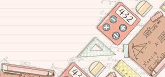

<html lang="en">
<head>
    <meta charset="UTF-8">
    <meta name="viewport" content="width=device-width, initial-scale=1.0">
    <meta http-equiv="X-UA-Compatible" content="ie=edge">
    <title>Media Pembelajaran</title>

    <!-- Bootstrap CSS -->
    <link href="https://cdn.jsdelivr.net/npm/bootstrap@5.3.0-alpha1/dist/css/bootstrap.min.css" rel="stylesheet">

    

</head>
<body>

<!-- Navbar -->
<nav class="navbar navbar-expand-lg navbar-dark bg-secondary">
    

        <a class="navbar-brand" href="#">NAELA MAGFIROH</a>
        <button class="navbar-toggler" type="button" data-bs-toggle="collapse" data-bs-target="#navbarNav" aria-controls="navbarNav" aria-expanded="false" aria-label="Toggle navigation">
            
        </button>
        

            <ul class="navbar-nav">
                <li class="nav-item">
                    <a class="nav-link" href="biodata.html">Biodata</a>
                </li>
                <li class="nav-item">
                    <a class="nav-link" href="kontak.html">Kontak Saya</a>
                </li>
            </ul>
        

    

</nav>

<!-- Jumbotron -->

    <h1 class="display-4" style="font-family: 'Poppins', sans-serif; font-weight: 600;">SELAMAT DATANG</h1>
    
Website Ini Berisi Tentang Materi Perbandingan Senilai

    <a class="btn btn-primary btn-lg pulse" href="video.html" role="button" style="font-family: 'Roboto', sans-serif;">KLIK UNTUK MULAI</a>

<!-- Content Section -->

    

        <!-- Materi Pembelajaran Card -->
        

            

                
                

                    <h5 class="card-title">Materi Perbandingan Senilai</h5>
                    <ul class="card-text">
                        <li>Pengertian Perbandingan Senilai</li>
                        <li>Syarat Perbandingan Senilai</li>
                        <li>Cara Perhitungan Perbandingan Senilai</li>
                        <li>Grafik Perbandingan Senilai</li>
                    </ul>
                    <a href="perbandingan_senilai.html" class="btn btn-primary pulse">Lihat Materi</a>
                

            

        

        
        <!-- Quiz Interaktif Card -->
        

            

                
                

                    <h5 class="card-title">Quiz</h5>
                    
Uji kemampuanmu dengan serangkaian kuis interaktif yang seru dan menantang! Setiap pertanyaan dirancang khusus untuk membantumu semakin jago dan percaya diri dalam memahami materi.

                    <a href="Quiz.html" class="btn btn-primary pulse">Mulai Kuis</a>
                

            

        

        <!-- Fitur Lain Card -->
        

            

                
                

                    <h5 class="card-title">Media Pemebelajaran</h5>
                    
Kami menyediakan fitur-fitur tambahan seperti video tutorial, diskusi online, dan banyak lagi untuk mendukung proses belajar Anda.

                    

                         <button class="btn btn-primary dropdown-toggle pulse" type="button" id="dropdownMenuButton" data-bs-toggle="dropdown" aria-expanded="false">
                            Mulai Jelajahi
                        </button>
                        <ul class="dropdown-menu" aria-labelledby="dropdownMenuButton">
                            <li><a class="dropdown-item" href="video.html">Video Pembelajaran</a></li>
                            <li><a class="dropdown-item" href="grafikgeogebra.html">GeoGebra Grafik</a></li>
                            <li><a class="dropdown-item" href="Lembar Kerja.html">Lembar Kerja</a></li>
                        </ul>
                    

                

            

        

         

            
Matematika Kelas 7

            

                <h5 class="card-title">Pendidikan Matematika</h5>
                
Kami berkomitmen untuk memberikan yang terbaik dalam pembelajaran matematika.

            

        

    

<!-- Bootstrap JS -->

</body>
</html>
